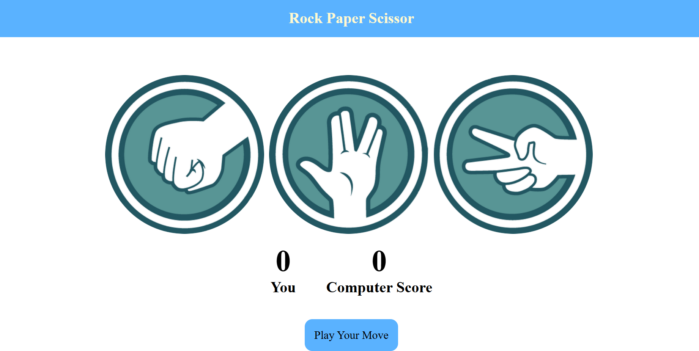
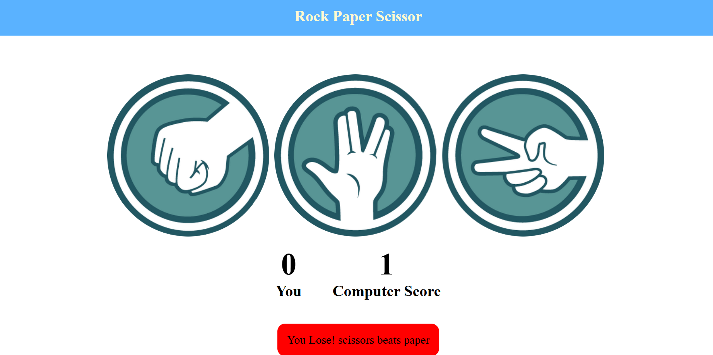
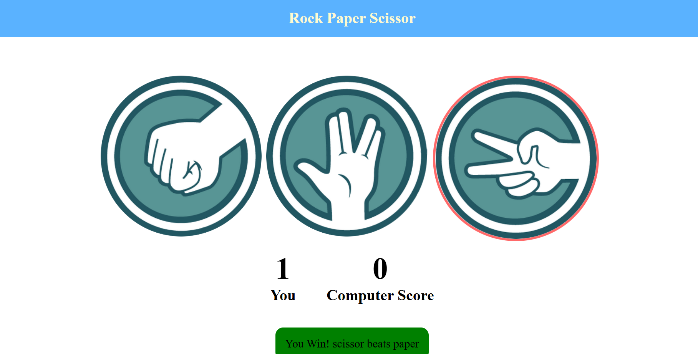

# This is a simple implementation of the classic Rock Paper Scissors game using HTML, CSS, and JavaScript.

## Table of Contents

- [Features](#features)
- [Technologies Used](#technologies-used)
- [Installation](#installation)
- [Usage](#usage)
- [Screenshots](#screenshots)
- [Known Issues](#known-issues)
- [Future Enhancements](#future-enhancements)
- [Contributing](#contributing)
- [License](#license)
- [Contact](#contact)

## Features

- Interactive Rock Paper Scissors game
- Displays user and computer scores
- Shows messages for win, lose, or draw
- Simple and clean UI design

## Technologies Used

- HTML
- CSS
- JavaScript

## Installation

To view and play the game locally, follow these steps:

1. Clone the repository:
   ```bash
   git clone https://github.com/Prince-1917/Profile-Card.git
2. Navigate to the project directory:
   ```bash
   cd Rock_Paper_Scissor_Game

3. Open index.html in your web browser.

## Usage
Click on either Rock, Paper, or Scissors to make your choice. The computer will randomly select its choice, and the result of the game will be displayed along with updated scores.

## Screenshots




## Known Issues
The game is currently implemented without a backend, so it does not save scores or user data.

## Future Enhancements
Add sound effects for wins, losses, and draws.
Implement a leaderboard to keep track of high scores.
Improve the UI design with more animations and transitions.
Add a reset button to restart the game.

## Contributing
Contributions are welcome! If you have any ideas or suggestions, feel free to open an issue or create a pull request.

## License
This project is licensed under the MIT License. See the LICENSE file for details.

## Contact
For any questions or feedback, please contact me at princesharma8050@gmail.com.